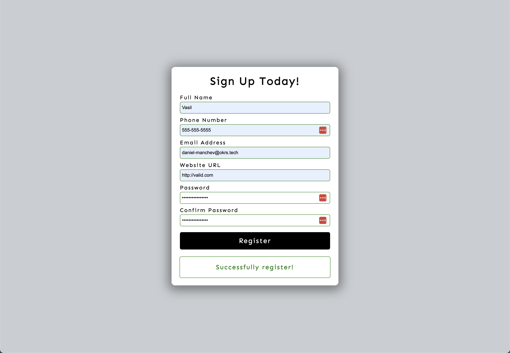

# Form validator

## URL

Try it out 🙌 https://vasildimov98.github.io/12.form-validator/

## Description

Introducing my handy form validator, designed to make your life easier when dealing with web forms. Tired of incomplete or incorrect submissions? With my form validator, you can ensure that user inputs are accurate and complete in real-time.

No more frustrating back-and-forth communication or manual data checking. My validator instantly examines form fields, applying validation rules like required fields, character limits, and email formats. It provides instant feedback, guiding users to correct any errors.

Simplify your form submission process and enhance user experience. Implement my form validator for hassle-free data entry and improved data quality. It's customizable to fit your needs, whether it's a simple contact form or a multi-step process.

Say goodbye to form errors and embrace smooth, error-free submissions. Try out my form validator today and enjoy the benefits of streamlined validation for your personal project.

